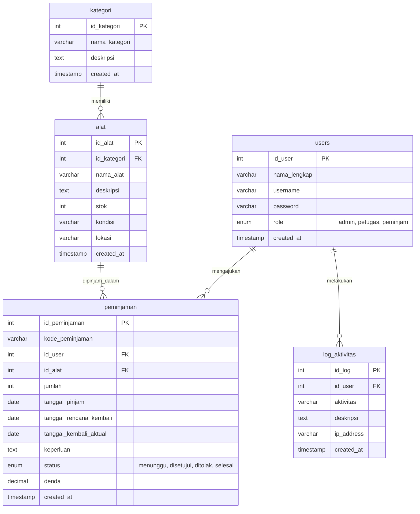

```mermaid
erDiagram
    users {
        int id_user PK
        varchar nama_lengkap
        varchar username
        varchar password
        enum role "admin, petugas, peminjam"
        timestamp created_at
    }

    kategori {
        int id_kategori PK
        varchar nama_kategori
        text deskripsi
        timestamp created_at
    }

    alat {
        int id_alat PK
        int id_kategori FK
        varchar nama_alat
        text deskripsi
        int stok
        varchar kondisi
        varchar lokasi
        timestamp created_at
    }

    peminjaman {
        int id_peminjaman PK
        varchar kode_peminjaman
        int id_user FK
        int id_alat FK
        int jumlah
        date tanggal_pinjam
        date tanggal_rencana_kembali
        date tanggal_kembali_aktual
        text keperluan
        enum status "menunggu, disetujui, ditolak, selesai"
        decimal denda
        timestamp created_at
    }

    log_aktivitas {
        int id_log PK
        int id_user FK
        varchar aktivitas
        text deskripsi
        varchar ip_address
        timestamp created_at
    }

    users ||--o{ peminjaman : "mengajukan"
    users ||--o{ log_aktivitas : "melakukan"
    kategori ||--o{ alat : "memiliki"
    alat ||--o{ peminjaman : "dipinjam_dalam"
```
